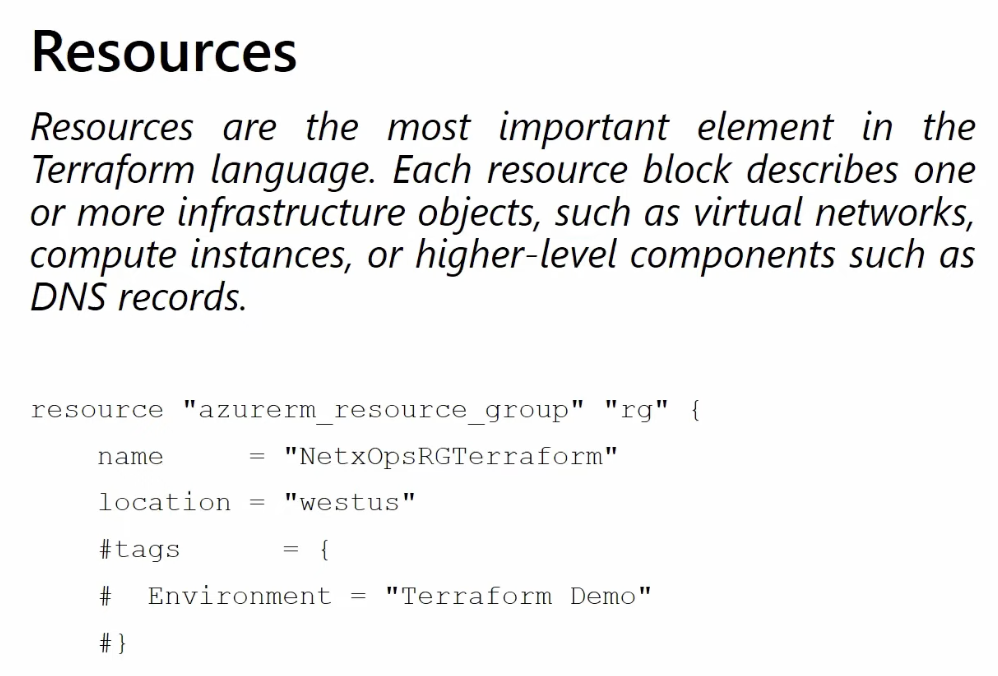

# Terraform Fundamentals



This document starts from absolute basics. If you are new to Terraform, read this file slowly before moving to the next ones.

## What Is Infrastructure as Code

Infrastructure as Code, often called IaC, means managing infrastructure through version-controlled files instead of only using a web portal or manual commands.

Infrastructure can include:

- virtual machines
- networks
- storage accounts
- Kubernetes clusters
- DNS records
- identity and access objects

Benefits of IaC:

- repeatability
- version history
- easier reviews
- automation
- easier recovery

## What Is Terraform

Terraform is an Infrastructure as Code tool from HashiCorp. You write configuration files that describe the infrastructure you want, and Terraform compares that desired state with the real environment and calculates what must change.

Terraform is declarative, which means:

- you describe the end result you want
- Terraform decides the order of operations needed to get there

This is different from imperative scripting, where you manually describe each individual step.

## Why Terraform Is Popular

Terraform is widely used because it:

- supports many cloud and platform providers
- uses a readable configuration language
- produces a plan before changes are applied
- supports reusable modules
- works well in CI/CD pipelines

## Terraform In Real Life

Teams use Terraform to manage:

- Azure resource groups, VNets, NSGs, VMs, and AKS
- AWS VPCs, EC2, IAM, and S3
- GCP projects and services
- Kubernetes resources
- GitHub repositories and permissions

In this repository, we focus mainly on Azure examples.

## The Terraform Workflow

The normal Terraform flow is:

1. Write `.tf` files
2. Run `terraform init`
3. Run `terraform fmt`
4. Run `terraform validate`
5. Run `terraform plan`
6. Run `terraform apply`

### `terraform init`

This prepares the working folder. It:

- downloads providers
- initializes modules
- configures the backend

### `terraform fmt`

This formats your files consistently. It does not create resources.

### `terraform validate`

This checks whether the configuration is syntactically valid and internally consistent.

### `terraform plan`

This shows what Terraform wants to create, update, or destroy.

### `terraform apply`

This performs the actual changes.

## What Terraform Files Usually Look Like

A Terraform folder commonly contains:

- `main.tf`
- `variables.tf`
- `outputs.tf`
- `provider.tf` or `versions.tf`
- `terraform.tfvars`

Terraform reads all `.tf` files in the same folder as one configuration.

## The Main Building Blocks

Terraform configurations are made of blocks.

Common blocks:

- `terraform`
- `provider`
- `resource`
- `data`
- `variable`
- `output`
- `locals`
- `module`

## Example: Small Terraform Configuration

```hcl
terraform {
  required_version = ">= 1.6.0"

  required_providers {
    azurerm = {
      source  = "hashicorp/azurerm"
      version = "~> 3.100"
    }
  }
}

provider "azurerm" {
  features {}
}

resource "azurerm_resource_group" "example" {
  name     = "rg-demo-dev"
  location = "East US"
}
```

This example contains:

- a `terraform` block for version and provider requirements
- a `provider` block that tells Terraform how to talk to Azure
- a `resource` block that creates a resource group

## Anatomy Of A Resource Block

```hcl
resource "azurerm_resource_group" "example" {
  name     = "rg-demo-dev"
  location = "East US"
}
```

Breakdown:

- `resource` is the block type
- `azurerm_resource_group` is the resource type
- `example` is the local Terraform name
- `name` and `location` are arguments

Terraform later refers to that resource as:

```hcl
azurerm_resource_group.example
```

## Desired State

Terraform works around the idea of desired state.

You declare what you want:

- one resource group
- one VNet
- three subnets
- one AKS cluster

Terraform then calculates:

- what already exists
- what must be created
- what must be changed
- what must be destroyed

## Idempotency

One of Terraform's most useful ideas is idempotency.

This means:

- running the same configuration again should not create duplicates if nothing changed

If your configuration and infrastructure already match, `terraform plan` should show no changes.

## Declarative Vs Imperative

Declarative example:

```hcl
resource "azurerm_resource_group" "example" {
  name     = "rg-demo-dev"
  location = "East US"
}
```

Imperative example:

- log into Azure
- click Create Resource Group
- type name and region
- click Create

Terraform is powerful because the declarative version is easier to repeat, review, and automate.

## Terraform Is Not Everything

Terraform is excellent for provisioning and managing infrastructure, but it is not:

- a backup system
- a full configuration management replacement
- an application deployment strategy by itself
- a monitoring platform

In real environments, Terraform works together with:

- CI/CD pipelines
- backup tools
- monitoring systems
- secret management tools
- Kubernetes or application deployment tools

## Beginner Mistakes To Avoid

- applying changes without reading the plan
- committing `terraform.tfstate` to Git
- hardcoding secrets in files
- changing real infrastructure manually in Azure without updating code
- putting all infrastructure for the whole company in one Terraform folder

## What To Learn Next

After this file, move to:

1. [03-providers.md](./03-providers.md)
2. [04-resources.md](./04-resources.md)
3. [05-variables-types-outputs-and-locals.md](./05-variables-types-outputs-and-locals.md)
