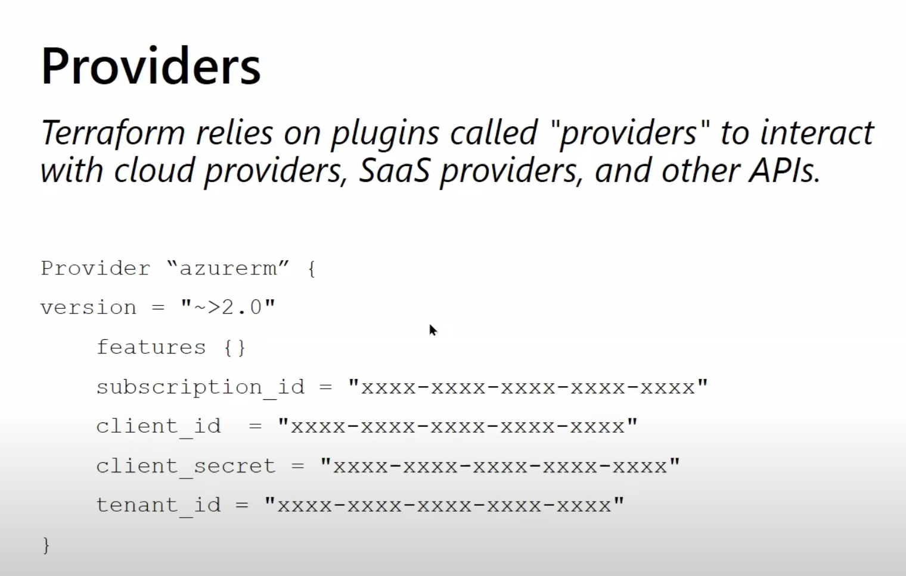

# Providers



Providers are one of the first Terraform concepts you must understand well.

## What Is A Provider

A provider is the plugin Terraform uses to communicate with an external platform or service.

Examples:

- `azurerm` for Azure Resource Manager
- `azuread` for Entra ID or Azure AD related objects
- `random` for generated values
- `local` for local files and local-only resources
- `kubernetes` for Kubernetes resources

Without providers, Terraform would have no way to create or read anything.

## Two Things Beginners Often Confuse

These are different:

- `required_providers`
- `provider`

### `required_providers`

This declares:

- which provider Terraform needs
- where to download it from
- which version should be used

Example:

```hcl
terraform {
  required_providers {
    azurerm = {
      source  = "hashicorp/azurerm"
      version = "~> 3.100"
    }
  }
}
```

### `provider`

This configures the provider after it is downloaded.

Example:

```hcl
provider "azurerm" {
  features {}
}
```

## Why Provider Version Pinning Matters

Providers change over time.

If you do not control versions, you may get:

- different plan behavior on different machines
- unexpected deprecations
- breaking changes in pipelines

Good practice:

- pin provider versions with a realistic version constraint

Example:

```hcl
version = "~> 3.100"
```

This usually means:

- use compatible versions around `3.100`
- avoid accidental jump to a future major release

## AzureRM Provider

This is the most common provider for Azure infrastructure.

Basic example:

```hcl
terraform {
  required_providers {
    azurerm = {
      source  = "hashicorp/azurerm"
      version = "~> 3.100"
    }
  }
}

provider "azurerm" {
  features {}
}
```

## How Terraform Authenticates To Azure

Terraform must authenticate before it can create resources.

Common approaches:

- Azure CLI login for local learning
- service principal for automation
- managed identity for Azure-hosted automation
- federated identity or OIDC for modern CI/CD systems

## Good Option For Beginners

When learning locally, a common simple flow is:

1. sign in with Azure CLI
2. run Terraform from the same terminal session

Example:

```bash
az login
az account set --subscription "<subscription-id>"
terraform init
terraform plan
```

## Provider Aliases

Provider aliases are used when you need multiple configurations of the same provider.

This is common in Azure when:

- you manage multiple subscriptions
- one subscription hosts shared networking
- another hosts application resources

Example:

```hcl
provider "azurerm" {
  features {}
  subscription_id = var.app_subscription_id
}

provider "azurerm" {
  alias           = "shared"
  features        {}
  subscription_id = var.shared_subscription_id
}
```

Later, a resource or module can explicitly use the aliased provider.

## Multiple Providers In One Configuration

One Terraform project may use more than one provider.

Example:

- `azurerm` to create Azure resources
- `azuread` to manage Entra ID groups
- `random` to create unique suffixes

Example:

```hcl
resource "random_pet" "suffix" {}

resource "azurerm_resource_group" "example" {
  name     = "rg-${random_pet.suffix.id}"
  location = "East US"
}
```

## Common Provider Mistakes

- not pinning versions
- forgetting to run `terraform init` after adding or changing a provider
- using the wrong Azure subscription
- mixing production and non-production credentials
- hiding provider configuration inside modules without a good reason

## Real Azure Example

```hcl
terraform {
  required_version = ">= 1.6.0"

  required_providers {
    azurerm = {
      source  = "hashicorp/azurerm"
      version = "~> 3.100"
    }
    azuread = {
      source  = "hashicorp/azuread"
      version = "~> 2.47"
    }
  }
}

provider "azurerm" {
  features {}
}

provider "azuread" {}
```

This example says:

- Terraform needs two providers
- both are downloaded during `terraform init`
- each provider can manage different kinds of objects

## How To Think About Providers

A useful mental model:

- Terraform is the engine
- providers are the adapters
- resources are the objects being managed

## What To Learn Next

After providers, move to [04-resources.md](./04-resources.md).
