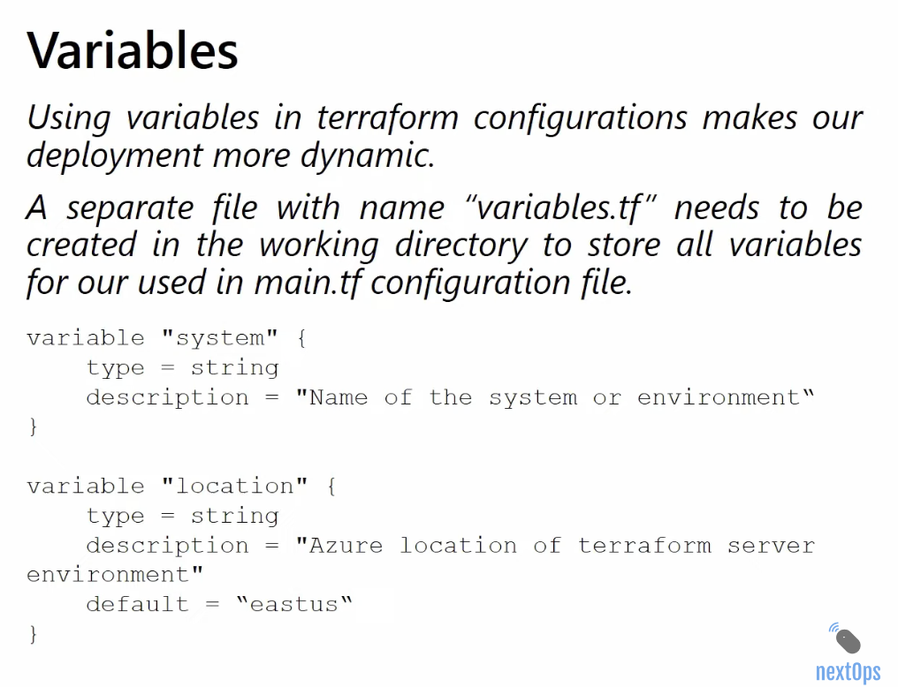
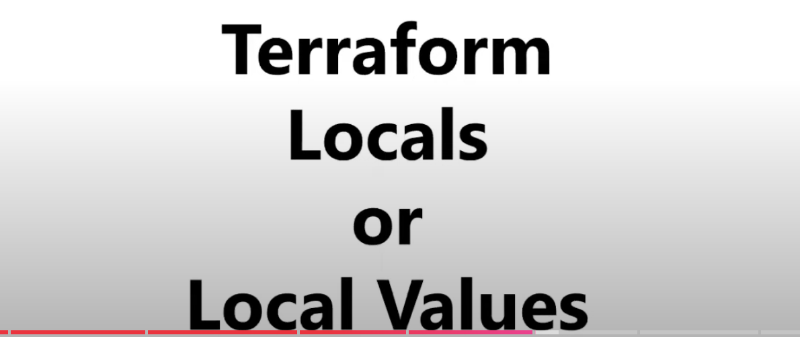

# Variables, Types, Outputs, And Locals





This file covers the Terraform concepts that make your code reusable and easier to maintain.

## Why Variables Matter

Without variables, Terraform code becomes hardcoded and difficult to reuse.

Variables help you change values such as:

- environment name
- Azure region
- resource group name
- VM size
- subnet CIDR ranges

## Input Variables

An input variable lets a user or calling module pass a value into Terraform.

Example:

```hcl
variable "location" {
  type        = string
  description = "Azure region for deployment"
  default     = "East US"
}
```

Use it like this:

```hcl
resource "azurerm_resource_group" "example" {
  name     = "rg-demo-dev"
  location = var.location
}
```

## Anatomy Of A Variable Block

Important arguments:

- `type`
- `description`
- `default`
- `sensitive`
- `nullable`

Example:

```hcl
variable "admin_password" {
  type        = string
  description = "Windows admin password"
  sensitive   = true
}
```

## Required Vs Optional Variables

- if a variable has no default, it is required
- if it has a default, it is optional

Required:

```hcl
variable "resource_group_name" {
  type = string
}
```

Optional:

```hcl
variable "location" {
  type    = string
  default = "East US"
}
```

## Terraform Data Types

Terraform supports many data types.

Important ones:

- `string`
- `number`
- `bool`
- `list`
- `set`
- `map`
- `object`
- `tuple`

## `string`

```hcl
variable "environment" {
  type    = string
  default = "dev"
}
```

## `number`

```hcl
variable "node_count" {
  type    = number
  default = 2
}
```

## `bool`

```hcl
variable "enable_diagnostics" {
  type    = bool
  default = true
}
```

## `list`

Use a list when order matters.

```hcl
variable "availability_zones" {
  type    = list(string)
  default = ["1", "2", "3"]
}
```

## `set`

Use a set when uniqueness matters and order does not.

```hcl
variable "allowed_ips" {
  type    = set(string)
  default = ["10.10.0.5", "10.10.0.6"]
}
```

## `map`

Use a map for key-value pairs.

```hcl
variable "tags" {
  type = map(string)
  default = {
    environment = "dev"
    owner       = "platform-team"
  }
}
```

## `object`

Use an object when several related settings belong together.

```hcl
variable "vm_config" {
  type = object({
    size           = string
    admin_username = string
    os_disk_type   = string
  })
}
```

## `tuple`

Tuple is like a fixed ordered sequence where each position can have its own type.

```hcl
variable "example_tuple" {
  type    = tuple([string, number, bool])
  default = ["dev", 2, true]
}
```

## Variable Validation

Validation helps catch bad values early.

Example:

```hcl
variable "environment" {
  type = string

  validation {
    condition     = contains(["dev", "test", "prod"], var.environment)
    error_message = "Allowed values are dev, test, or prod."
  }
}
```

## How Variable Values Are Passed

Common ways:

- default value in `variables.tf`
- `terraform.tfvars`
- `*.auto.tfvars`
- CLI `-var`
- CLI `-var-file`
- environment variables such as `TF_VAR_location`

## Example `terraform.tfvars`

```hcl
location            = "East US"
resource_group_name = "rg-demo-dev"
environment         = "dev"
```

## Locals

Locals are named expressions used inside the current module.

They help avoid repetition.

Example:

```hcl
locals {
  prefix = "demo-${var.environment}"
  common_tags = {
    environment = var.environment
    managed_by  = "terraform"
  }
}
```

Use them like this:

```hcl
resource "azurerm_resource_group" "example" {
  name     = "rg-${local.prefix}"
  location = var.location
  tags     = local.common_tags
}
```

## Variables Vs Locals

Use variables when:

- the value should come from the outside

Use locals when:

- the value is derived inside the module

## Outputs

Outputs expose values from a module or root configuration.

Example:

```hcl
output "resource_group_name" {
  value = azurerm_resource_group.example.name
}
```

Outputs are useful for:

- showing important values after apply
- passing values from child modules to root modules
- integrations between Terraform layers

## Sensitive Outputs

If an output contains a secret or sensitive information, mark it as sensitive.

```hcl
output "admin_password" {
  value     = var.admin_password
  sensitive = true
}
```

## Real Azure Example

```hcl
variable "environment" {
  type    = string
  default = "dev"
}

variable "location" {
  type    = string
  default = "East US"
}

locals {
  prefix = "payments-${var.environment}"
  common_tags = {
    environment = var.environment
    managed_by  = "terraform"
  }
}

resource "azurerm_resource_group" "example" {
  name     = "rg-${local.prefix}"
  location = var.location
  tags     = local.common_tags
}

output "resource_group_id" {
  value = azurerm_resource_group.example.id
}
```

## Common Beginner Mistakes

- using too many variables when locals are enough
- hardcoding repeated tag maps instead of using locals
- not validating important inputs
- exposing sensitive values carelessly
- passing every variable from root to child module without thinking about module design

## What To Learn Next

After this, move to [06-state-backends-locking-and-workspaces.md](./06-state-backends-locking-and-workspaces.md).
