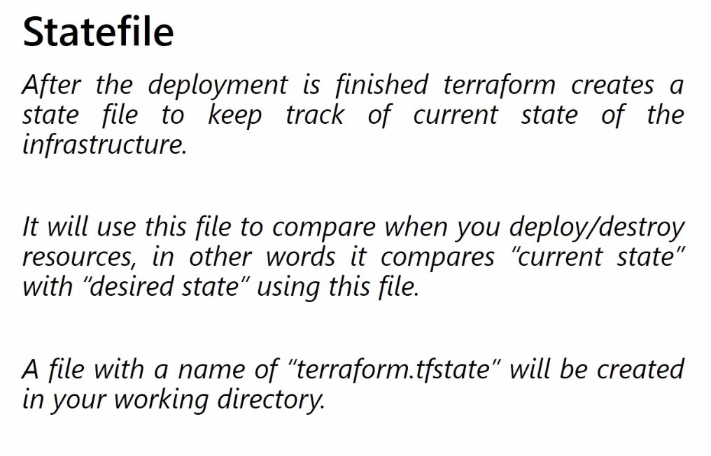
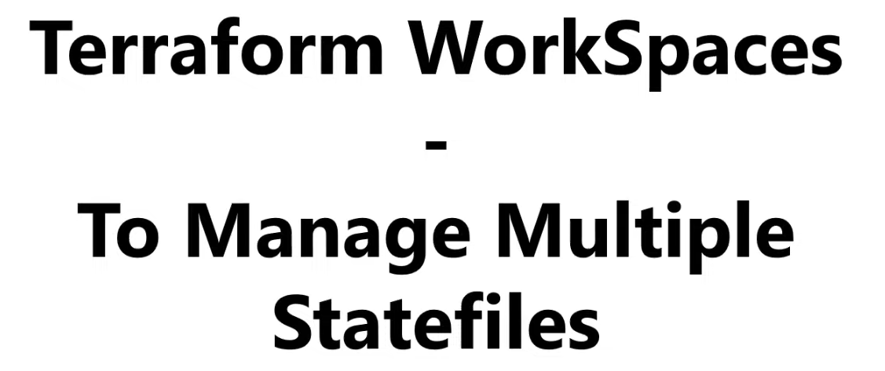

# State, Backends, Locking, And Workspaces





State is one of the most important Terraform topics. Many real production problems come from weak state management.

## What Is Terraform State

Terraform state is Terraform's record of the infrastructure it manages.

It maps:

- Terraform resource addresses
- real infrastructure objects in Azure

Terraform uses state to understand:

- what it created before
- what changed since the last run
- what needs to be updated or deleted

## Why State Matters

Without correct state, Terraform may:

- think a resource does not exist and try to recreate it
- show wrong plans
- lose track of dependencies
- create dangerous drift between code and reality

## The Local State File

By default, Terraform stores state locally in:

- `terraform.tfstate`

Sometimes you may also see:

- `terraform.tfstate.backup`

These files should not be committed to Git.

## What State Usually Contains

State may include:

- resource IDs
- names
- computed attributes
- outputs
- dependency information

Because of that, state may sometimes contain sensitive information or infrastructure details.

## Local State Vs Remote State

### Local state

Good for:

- short personal experiments
- early learning

Bad for:

- team collaboration
- production workloads

### Remote state

Good for:

- shared environments
- safer collaboration
- locking
- recovery and auditing

## What Is A Backend

A backend tells Terraform where state should be stored.

Examples:

- local backend
- AzureRM backend
- Terraform Cloud backend

## Azure Remote Backend

On Azure, a common backend uses:

- one resource group
- one storage account
- one blob container

Example:

```hcl
terraform {
  backend "azurerm" {
    resource_group_name  = "rg-tfstate"
    storage_account_name = "tfstatedemostorage"
    container_name       = "tfstate"
    key                  = "dev.network.terraform.tfstate"
  }
}
```

## Bootstrap Rule

Do not store the backend resources in the same state file that depends on them.

Instead:

- create backend infrastructure in a separate bootstrap process or state

## State Locking

Locking prevents two users or pipelines from changing the same state at the same time.

Why it matters:

- it reduces race conditions
- it prevents conflicting applies
- it protects the integrity of shared workflows

## `terraform force-unlock`

This command can remove a stuck lock, but use it carefully.

Only use it when:

- you are sure no valid apply is still running

Never use it casually just because Terraform says the state is locked.

## State Commands You Must Know

```bash
terraform state list
terraform state show <resource_address>
terraform state mv <old_address> <new_address>
terraform state rm <resource_address>
terraform state pull
terraform force-unlock <LOCK_ID>
```

## `terraform state list`

Shows all resources currently tracked in state.

## `terraform state show`

Shows details of one tracked resource.

## `terraform state mv`

Moves a resource from one Terraform address to another without recreating the real object.

This is useful during refactoring.

## `terraform state rm`

Removes a resource from state without deleting the real infrastructure.

This is powerful and potentially dangerous.

## What Is Drift

Drift means:

- the real Azure infrastructure changed outside Terraform
- Terraform code and state no longer match reality

Examples:

- someone changes an NSG rule in the Azure portal
- someone deletes a subnet manually
- someone changes tags through Azure CLI

## How To Detect Drift

The most common way:

```bash
terraform plan
```

If the plan shows unexpected differences, inspect them before applying anything.

## Workspaces

Workspaces let one configuration keep multiple separate state files.

Examples:

- `default`
- `dev`
- `test`
- `prod`

Commands:

```bash
terraform workspace list
terraform workspace new dev
terraform workspace select dev
```

## When Workspaces Are Useful

Good for:

- simple learning
- small isolated environment copies
- temporary test environments

## When Workspaces Are Not Enough

For serious Azure environments, many teams prefer:

- separate root modules or folders per environment

instead of relying only on workspaces.

Why:

- access control is clearer
- state boundaries are clearer
- production mistakes are easier to avoid

## Real Azure Example

A production team may keep separate states for:

- backend bootstrap
- shared network
- shared monitoring
- AKS platform
- application workloads

This is often safer than one giant state for everything.

## Common Beginner Mistakes

- committing state to Git
- using the wrong backend key
- using the wrong workspace
- force-unlocking without checking active runs
- refactoring resources without understanding state addresses

## What To Learn Next

After this, move to [07-provisioners-and-dependency-handling.md](./07-provisioners-and-dependency-handling.md).
