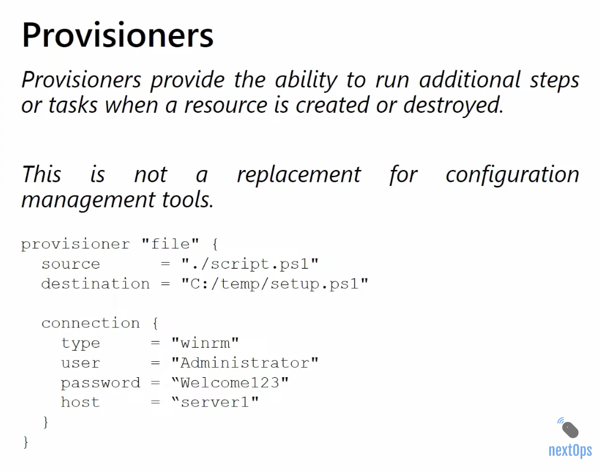
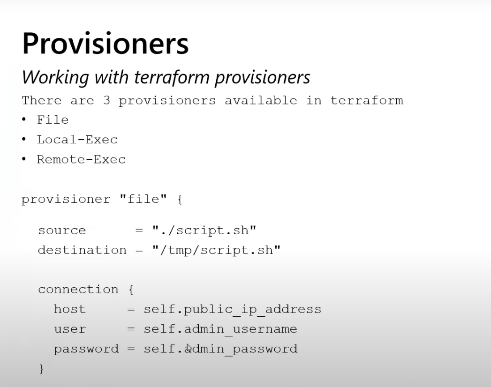

# Provisioners And Dependency Handling





Provisioners are a Terraform feature that beginners often find attractive, but they should be used carefully.

## What Is A Provisioner

A provisioner runs a script or command on the local machine or a remote machine as part of resource creation or destruction.

Common provisioners:

- `local-exec`
- `remote-exec`
- `file`

## Why Provisioners Exist

They can be used to:

- run local shell commands
- copy files to a VM
- execute commands on a newly created VM

## Why Terraform Experts Are Careful With Provisioners

Provisioners are often considered a last resort because:

- they are harder to make reliable
- they can be difficult to re-run safely
- they mix provisioning and configuration steps
- failures can leave resources partially configured

In many environments, tools such as cloud-init, VM extensions, Packer, or configuration management are better choices.

## `local-exec`

Runs a command on the machine where Terraform is executed.

Example:

```hcl
resource "null_resource" "notify" {
  provisioner "local-exec" {
    command = "echo Terraform apply completed"
  }
}
```

## `remote-exec`

Runs commands on a remote machine after connection.

Example:

```hcl
provisioner "remote-exec" {
  inline = [
    "sudo apt-get update",
    "sudo apt-get install -y nginx"
  ]
}
```

## `file`

Copies a file or content to a remote machine.

Example:

```hcl
provisioner "file" {
  source      = "app.conf"
  destination = "/tmp/app.conf"
}
```

## Better Alternatives To Provisioners

Prefer these when possible:

- custom VM images
- cloud-init
- Azure VM extensions
- configuration management tools
- application deployment pipelines

## Dependency Handling

Terraform must know the right order to create and destroy resources.

It usually learns that from references.

## Implicit Dependency

Example:

```hcl
resource "azurerm_resource_group" "example" {
  name     = "rg-demo-dev"
  location = "East US"
}

resource "azurerm_virtual_network" "example" {
  name                = "vnet-demo-dev"
  location            = azurerm_resource_group.example.location
  resource_group_name = azurerm_resource_group.example.name
  address_space       = ["10.0.0.0/16"]
}
```

Terraform automatically knows the VNet depends on the resource group.

## Explicit Dependency

Use `depends_on` when Terraform cannot infer the dependency.

Example:

```hcl
resource "azurerm_storage_account" "example" {
  name                     = "storagedemodev123"
  resource_group_name      = azurerm_resource_group.example.name
  location                 = azurerm_resource_group.example.location
  account_tier             = "Standard"
  account_replication_type = "LRS"

  depends_on = [azurerm_resource_group.example]
}
```

In this example, `depends_on` is not strictly necessary because references already exist, but it shows the syntax.

## Lifecycle Rules

Terraform supports lifecycle settings that affect how resource changes are handled.

Important lifecycle arguments:

- `create_before_destroy`
- `prevent_destroy`
- `ignore_changes`
- `replace_triggered_by`

## `create_before_destroy`

Useful when replacement is needed and downtime should be reduced.

## `prevent_destroy`

Useful for critical resources such as:

- core networking
- shared storage
- production databases

Use carefully because it can block legitimate changes too.

## `ignore_changes`

This tells Terraform to ignore specific changes on a resource.

Use carefully because it can hide drift.

## Real Azure Example

Imagine you manage a storage account that gets updated by a separate system for a very specific attribute. You might ignore that attribute temporarily, but you must document why.

Do not use `ignore_changes` as a shortcut for poor ownership or weak design.

## Best Practice Summary

- prefer implicit dependency
- use explicit dependency only when needed
- avoid provisioners unless there is a strong reason
- prefer stable infrastructure design over command-based fixes

## What To Learn Next

After this, move to [08-modules-and-folder-structure.md](./08-modules-and-folder-structure.md).
