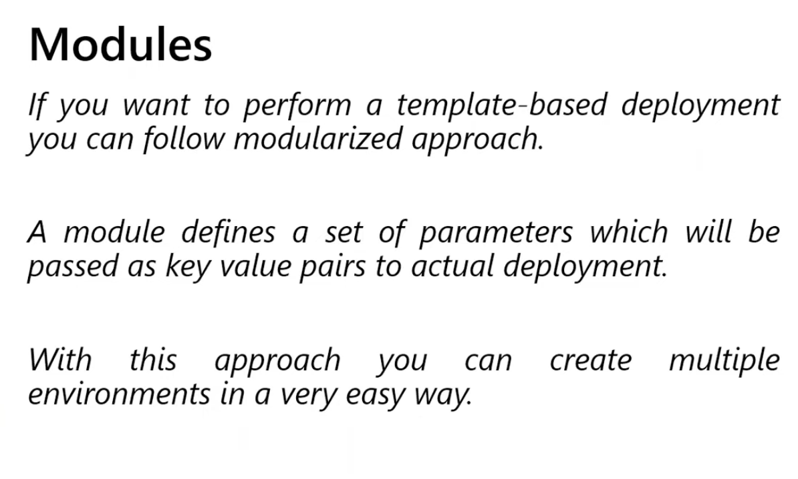

# Modules And Folder Structure



Modules are one of the biggest steps from beginner Terraform to reusable team-ready Terraform.

## What Is A Module

A module is a folder containing Terraform configuration files.

Types of modules:

- root module
- child module

### Root module

The folder where you run Terraform commands.

### Child module

A reusable module called by another module using the `module` block.

## Why Modules Matter

Modules help with:

- reuse
- consistency
- cleaner root modules
- easier reviews
- standardization across environments

## Simple Module Example

Imagine this child module:

```text
modules/resource-group/
  main.tf
  variables.tf
  outputs.tf
```

Inside `modules/resource-group/main.tf`:

```hcl
resource "azurerm_resource_group" "this" {
  name     = var.name
  location = var.location
}
```

Inside `variables.tf`:

```hcl
variable "name" {
  type = string
}

variable "location" {
  type = string
}
```

Inside `outputs.tf`:

```hcl
output "id" {
  value = azurerm_resource_group.this.id
}
```

## Calling A Module

From a root module:

```hcl
module "resource_group" {
  source   = "./modules/resource-group"
  name     = "rg-demo-dev"
  location = "East US"
}
```

## What Makes A Good Module

A good module:

- has one clear responsibility
- accepts clean inputs
- exposes useful outputs
- avoids hidden side effects
- works in more than one environment

## What Makes A Bad Module

A bad module:

- creates too many unrelated resources
- hardcodes environment values
- mixes shared platform and application concerns
- has confusing input names
- forces consumers to read all internals just to use it

## Common Module Files

Typical module structure:

```text
modules/network/
  main.tf
  variables.tf
  outputs.tf
  versions.tf
  README.md
```

## Recommended Azure Repository Structure

One strong pattern is:

```text
terraform/
  modules/
    resource-group/
    network/
    aks/
    key-vault/
  live/
    dev/
      network/
      platform/
      app1/
    prod/
      network/
      platform/
      app1/
```

Why this works:

- modules are reusable
- environments are explicit
- state boundaries are easier to control

## Folder Structure For Smaller Projects

For smaller learning projects, one root module can still be fine:

```text
my-terraform-project/
  main.tf
  variables.tf
  outputs.tf
  provider.tf
  terraform.tfvars
```

Start simple, then modularize when repetition or complexity grows.

## When To Create A Module

Create a module when:

- the same pattern repeats in multiple places
- several environments need the same building block
- you want standard naming, tags, and controls

Do not create modules too early for one tiny example if they make learning harder.

## Module Inputs And Outputs

Inputs are variables.

Outputs expose useful values back to the caller.

Example:

```hcl
output "resource_group_name" {
  value = azurerm_resource_group.this.name
}
```

## Module Sources

Modules can come from:

- local paths
- Terraform Registry
- Git repositories

Examples:

```hcl
source = "./modules/network"
```

```hcl
source = "git::https://github.com/example/terraform-modules.git//network"
```

## Versioning Modules

When modules are shared, version them carefully.

Good practices:

- tag releases
- document breaking changes
- pin versions in production

## Azure-Specific Advice

For Azure, separate modules for:

- resource groups
- networking
- monitoring
- AKS
- shared platform services

Do not hide too much logic in giant mega-modules.

## Common Beginner Mistakes

- copying folders instead of creating modules
- creating very large modules too early
- hardcoding names and regions inside modules
- using one module for all Azure resources in the environment

## What To Learn Next

After this, move to [09-data-sources-import-and-brownfield.md](./09-data-sources-import-and-brownfield.md).
