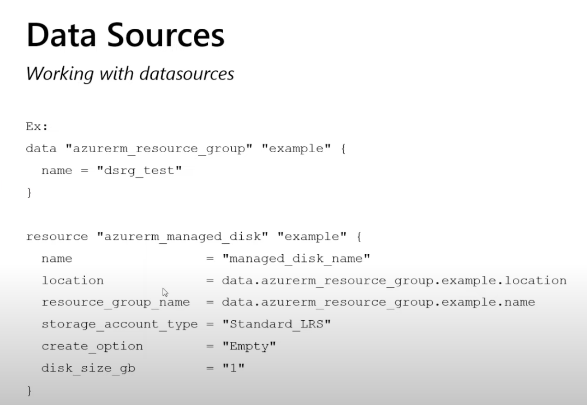
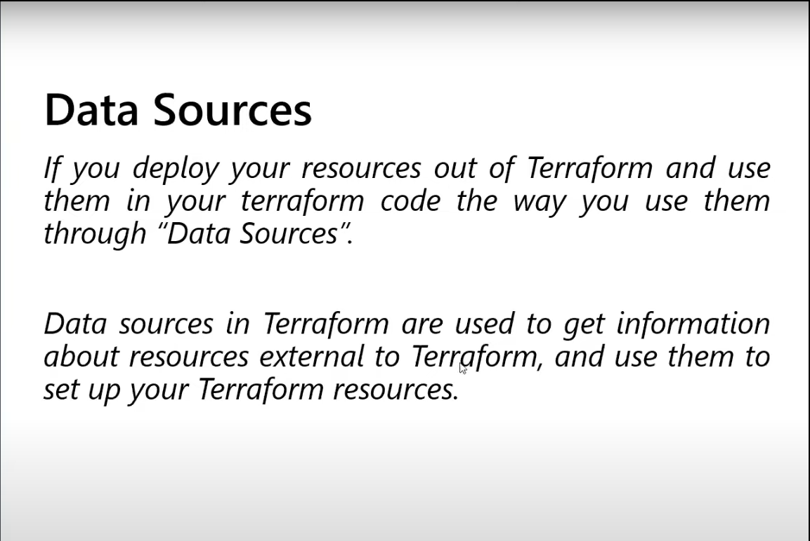

# Data Sources, Import, And Brownfield Terraform





This file explains how Terraform works with infrastructure that already exists.

## What Is A Data Source

A data source reads information from an existing resource instead of creating a new one.

This is one of the most important differences in Terraform:

- `resource` creates or manages
- `data` reads existing information

## Example Data Source

```hcl
data "azurerm_resource_group" "existing" {
  name = "rg-shared-network"
}
```

You can then use the data source:

```hcl
output "existing_rg_location" {
  value = data.azurerm_resource_group.existing.location
}
```

## Why Data Sources Are Useful

They are useful when:

- the resource already exists
- another team owns it
- you only need to read values from it
- shared infrastructure is managed in another state

## Real Azure Example

Reading supported AKS versions:

```hcl
data "azurerm_kubernetes_service_versions" "current" {
  location = "East US"
}
```

Then using it:

```hcl
output "latest_version" {
  value = data.azurerm_kubernetes_service_versions.current.latest_version
}
```

## Data Sources Vs Module Outputs

Use data sources when:

- the resource exists outside your current Terraform configuration

Use module outputs when:

- the resource is created inside a module you are calling

## What Is Import

Import tells Terraform:

- this resource already exists
- start tracking it in Terraform state

Import does not automatically write your Terraform code for you.

You should first write the resource block, then import.

## Import Syntax

```bash
terraform import <resource_address> <resource_id>
```

## Azure Import Example

```bash
terraform import azurerm_resource_group.example \
  /subscriptions/00000000-0000-0000-0000-000000000000/resourceGroups/rg-demo-dev
```

## Safe Import Process

1. write the Terraform resource block first
2. run `terraform import`
3. run `terraform plan`
4. compare the imported object with your configuration
5. adjust the code until the plan makes sense

## What Is Brownfield Terraform

Brownfield means:

- infrastructure already exists before Terraform starts managing it

This is very common in real companies.

Examples:

- existing Azure VNets
- existing resource groups
- manually created storage accounts
- manually created AKS clusters

## Brownfield Strategy

A careful approach:

1. discover what already exists
2. decide the right state boundaries
3. write Terraform code that matches reality
4. import resources gradually
5. run plans and validate every change

## Do Not Import Everything At Once

That is a common mistake.

Instead:

- start with the most important resources
- group them by ownership and lifecycle
- keep shared platform and app resources separate

## Import Vs Data Source

Use import when:

- Terraform should manage the resource

Use a data source when:

- Terraform only needs to read the resource

## Common Beginner Mistakes

- importing before writing the resource block
- importing too many resources into one giant state
- treating imported infrastructure as if it were greenfield
- applying changes before fully understanding the plan after import

## What To Learn Next

After this, move to [10-azure-real-world-terraform.md](./10-azure-real-world-terraform.md).
