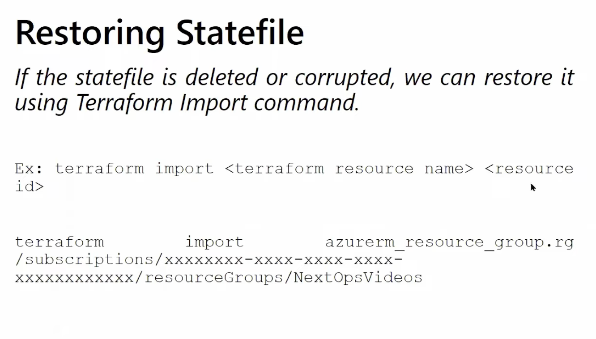

# Backups, Restore, And Disaster Recovery



Terraform helps rebuild infrastructure, but it is not a full backup system. You still need backup and recovery thinking.

## What Terraform Can Restore

Terraform can often recreate infrastructure definitions such as:

- resource groups
- networks
- VMs
- AKS clusters
- storage accounts

But Terraform does not automatically restore:

- VM file systems
- database contents
- application data
- secrets history

## Four Things You Must Protect

### 1. Terraform code

Protect with:

- Git
- reviews
- branch policies

### 2. Terraform state

Protect with:

- remote backend
- locking
- restricted access
- retention or recovery settings where possible

### 3. Infrastructure definitions

Protect with:

- module versioning
- reproducible configurations
- documented environment structure

### 4. Application and platform data

Protect with:

- Azure Backup
- database-native backups
- disk snapshots
- storage versioning or retention

## State Recovery Basics

If state is damaged or missing, do not panic and do not blindly apply.

First:

1. stop all active runs
2. confirm the backend and workspace
3. retrieve the current state if possible
4. back up what you have before changing anything

## Azure Backend Protection

For Azure Storage backend, good practices include:

- dedicated backend resource group
- dedicated storage account
- limited access
- monitoring
- retention and recovery features according to your platform policy

## Backups Vs Snapshots

These are not the same.

### Backup

Usually part of a planned recovery strategy over time.

### Snapshot

Usually a point-in-time copy before a risky change.

In Azure:

- Azure VM backup and managed disk snapshots are related but not identical

## Disk Snapshots

Good for:

- pre-maintenance safety
- pre-upgrade safety
- quick point-in-time recovery support

Not enough by themselves for:

- full application recovery strategy

## Database Recovery

For databases, rely on the database platform's own recovery features in addition to Terraform.

Examples:

- point-in-time restore
- backup retention
- replication or failover strategy

Terraform can provision parts of the configuration, but the restore process must still be practiced separately.

## AKS Recovery Thinking

For AKS, protect:

- cluster infrastructure code
- cluster configuration
- application manifests or Helm values
- container images
- persistent data
- external databases

Recreating the AKS cluster is not the same as restoring the workloads and data.

## Example Recovery Scenario: Resource Deleted Manually

If someone manually deletes an Azure resource:

1. confirm what was deleted
2. assess data and dependency impact
3. decide whether to recreate, restore, or import
4. reconcile state afterward

## Example Recovery Scenario: State File Problem

If the state is wrong or lost:

1. verify backend settings
2. inspect available backend recovery options
3. pull or restore state carefully
4. run `terraform plan`
5. avoid `apply` until the plan is fully understood

## Recovery Commands You May Need

```bash
terraform state pull
terraform state list
terraform state show <resource>
terraform import <resource_address> <resource_id>
terraform force-unlock <LOCK_ID>
```

## Disaster Recovery Questions To Ask

- How quickly must the environment return
- How much data loss is acceptable
- Who performs the restore
- Where is the runbook stored
- Has the restore path been tested

## Common Mistakes

- assuming Terraform state is a backup
- assuming snapshots are a full recovery solution
- never testing restore steps
- restoring infrastructure but forgetting application data

## Expert Habit

Before risky changes, always ask:

- if this breaks, how do we restore it
- is that restore path documented and tested
